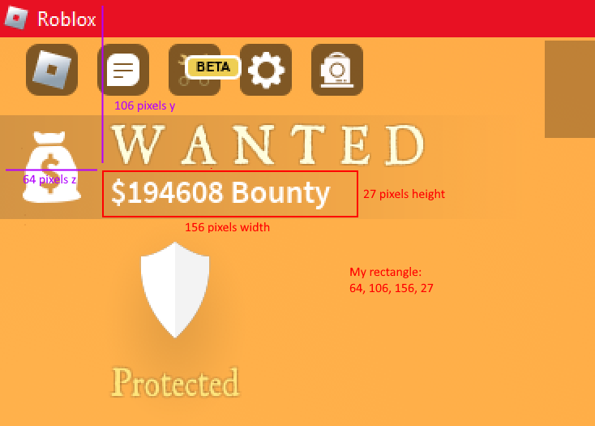
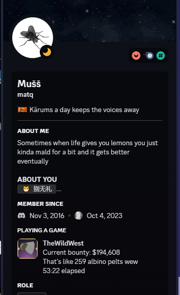

# TheWildWest: BountyTracker
# You MUST have [Tesseract](https://digi.bib.uni-mannheim.de/tesseract/tesseract-ocr-w64-setup-5.3.3.20231005.exe), [Python](https://www.python.org/downloads/) and pip bootstrap to run this window
# To install needed libraries just open the Install.bat file I've added, if you don't have pip reinstall python checking the pip bootstrap box
## To run open BountyTracker.py

### The app doesn't detect when bounty has been lost because it only reads the specified rectangle where the bounty is on your screen
### If the app can't detect the bounty try adjusting the capture rectangle in Capture.txt (change the show capture option to true instead of false to help with adjusting)
### I also recommend to use an image editor to find the coordinates for your screen

This app will update your discord presence like this:
 - The time elapsed will show the time since the bounty was last updated even after rebooting the app it will remember the last time this bounty was reached (saves to file LastBounty)
 - The different icons and messages will update periodically
 - Hovering the icon will show your dead bounty which is 40% of your alive bounty

