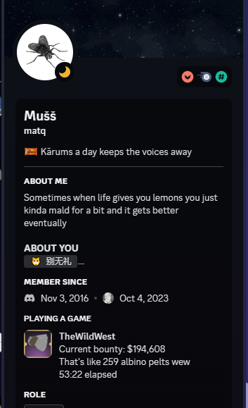
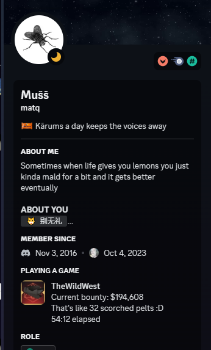
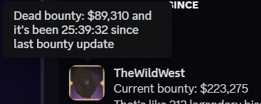

[comment]: <> ([23/12/2023] Thanks to .luobu for testing)
# TheWildWest: BountyTracker
## Installation
You will need these dependencies:
 - [Python](https://www.python.org/downloads/) with the pip bootstrap
 - Some libraries (installs with pip when running the app)
 - Tesseract (downloads with libraries when running the app,
but you will have to install it yourself because administrator privilages)

## Usage
To install / run open BountyTracker.exe

To uninstall libraries run Uninstall.exe (you have to uninstall tesseract yourself since it needs admin privilages)

If the app can't detect the bounty try adjusting the capture rectangle in Capture.txt (change the show capture option to true instead of false to help with adjusting)

I also recommend to use an image editor to find the coordinates for your screen

This app will update your discord presence like this:
 - The time you've kept your bounty for is shown when hovering the icon in discord (saves to file LastBounty)
 - The different icons and messages will update periodically
 - Hovering the icon will show your dead bounty which is 40% of your alive bounty

## Issues
The app doesn't detect when bounty has been lost because it only reads the specified rectangle where the bounty is on your screen

## Alternative links for dependencies
[Tesseract](https://www.google.com/url?sa=t&rct=j&q=&esrc=s&source=web&cd=&ved=2ahUKEwiz0_vtqKSDAxWjERAIHYegAoMQFnoECA4QAQ&url=https%3A%2F%2Fsourceforge.net%2Fprojects%2Ftesseract-ocr-alt%2Ffiles%2Ftesseract-ocr-setup-3.02.02.exe%2Fdownload&usg=AOvVaw1rP0XHY_cpKegWb85nK_Mo&opi=89978449)
