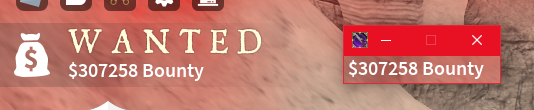
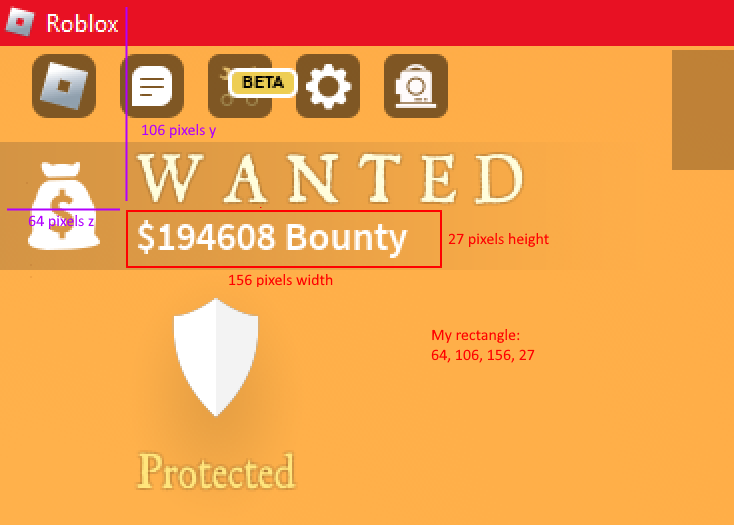

[comment]: <> ([23/12/2023] Thanks to Totally_Natural for testing)
[comment]: <> ([28/02/2024] Thanks to ThunderBeast817 for wallet screenshot)
# TheWildWest: BountyTracker
## Installation
You will need these dependencies:
 - [Python](https://www.python.org/downloads/)
 - pip (it comes with Python, open command prompt and type "pip" to check if you have it)
 - [Tesseract optical character recognition](https://downloads.sourceforge.net/project/tesseract-ocr-alt/tesseract-ocr-setup-3.02.02.exe?ts=gAAAAABlh0rv-caw3tHhQdJ2gIURc8E-fr0Wl-k6t-XMqpkjwNWMdXrhmYg5WtV7JvFwlW9jfgSIIoe_6SxZumFImStJkzGcpw%3D%3D&amp;use_mirror=kumisystems&amp;r=https%3A%2F%2Fwww.google.com%2F) 
(if it's missing the program will download it for you, but you can download it yourself if you want to. you have to install it yourself because it requires admin privilages)
 - [ImDisk Toolkit](https://downloads.sourceforge.net/project/imdisk-toolkit/20240210/ImDiskTk-x64.zip?ts=gAAAAABl82xl4MAqL01bx9vmWpqtEAdTGUTDAErm8_jyQWfQGzS71z0HraafbrVSwYmn6K3H5wLBvJoTV3hvR9hC5TSNQ8SUyg%3D%3D&amp;r=https%3A%2F%2Fsourceforge.net%2Fprojects%2Fimdisk-toolkit%2Ffiles%2Flatest%2Fdownload)(Optional)
this tool allows you to create a virtual disk on your ram, it can speed up the loading and saving times for tesseract-ocr because it requires to save the image to a disk before extracting optical characters(example: bounty label on your screen).

## Usage
To setup and run the program open BountyTracker.exe (if you don't trust random exe files on the internet you can open BountyTracker.py instead, but I assure I didn't put any malicious software in this project)

To uninstall libraries run Uninstall.exe (or Uninstall.bat, you have to uninstall tesseract yourself since it needed admin privilages to install in the first place)

If the app can't detect the bounty you need to adjust the capture_rectangle in Capture.txt (change the capture_preview = true to help you see what the computer sees)

If the capture_preview option doesn't help use an image editor to figure out the coordinates for your rectangle

BountyTracker will update your discord presence (if enabled) like this:
 - The time you've kept your bounty for is shown when hovering the icon in discord (saves to file LastBounty)
 - The different icons and messages will update periodically
 - Hovering the icon will show your dead bounty which is 40% of your alive bounty

## Issues
The app doesn't detect when bounty has been lost because it only reads the specified rectangle where the bounty is on your screen
